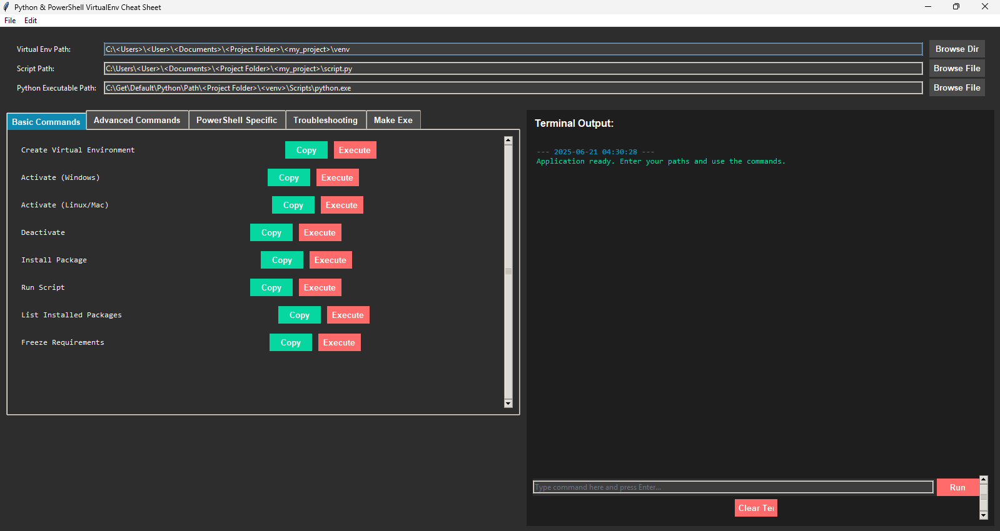

# Python & PowerShell VirtualEnv Cheat Sheet


A Tkinter-based GUI tool for managing Python virtual environments and executing PowerShell commands — built for developers and IT professionals on Windows 11 (but cross-platform compatible).

---

## 📋 Features

- Set paths for virtual environments, scripts, and Python executables  
- Predefined templates for common dev tasks:
  - Create/activate virtualenv
  - Install packages
  - Run scripts
  - Build with PyInstaller
- Integrated terminal output display
- Copy-to-clipboard functionality
- Save/load configurations
- Error logging and pop-up messages
- Dark theme UI
- Works on Windows, Linux, macOS

---

## ⚙️ Prerequisites

- **Python 3.7+**
- **Tkinter**: Included with Python
- **Pyperclip**: Install via `pip install pyperclip`
- **Subprocess**: Built-in module

---

## 🚀 Installation

```bash
git clone https://github.com/yourusername/virtualenv-cheat-sheet.git
cd virtualenv-cheat-sheet
pip install -r requirements.txt
python main.py
```

---

## 🧰 Usage

### Setting Paths
Use the GUI to set:
- Virtual Environment Path
- Script Path
- Python Executable Path  
You can also modify default paths in the code:

```python
# Default paths (can be pre-filled)
    self.env_entry.insert(0, os.path.expanduser("~/Documents/Projects/my_project/venv"))
    self.script_entry.insert(0, os.path.expanduser("~/Documents/Projects/my_project/script.py"))
    self.py_path_entry.insert(0, self._get_default_python_path())
```

### Generating Commands
- Use tabs to select command templates.
- Click **Copy** to copy to clipboard or **Execute** to run directly.

### Terminal Output
- View command results in real-time.
- Type custom commands manually and click **Run**.

### Saving/Loading Configurations
- Save/load path and settings via **File > Save Config / Load Config**

---

## 🖼️ Screenshots

| Main Interface | Terminal Output |
|---------------|------------------|
|  |  |

| *All tabs together:* | 
|---------------------|
 *(made with Paint 😅)*

---

## 🤝 Contributing

Contributions are welcome! Please follow these steps:
1. Fork the repo
2. Create a feature branch: `git checkout -b feature/your-feature-name`
3. Commit changes
4. Push to your fork
5. Open a Pull Request
---

## 📄 License

MIT License – see [LICENSE](LICENSE) for details.

---

## 🙌 Acknowledgments

- Thanks to **Tkinter** and **Pyperclip** for enabling core functionality.

---

## 👨‍💻 About the Author   

**Thiago Maria - From Brazil to the World 🌎**  
*Senior Security Information Professional | Passionate Programmer | AI Developer*

With a professional background in security analysis and a deep passion for programming, I created this repo share some knowledge about security information, cybersecurity, Python and development practices. Most of my work here focuses on implementing security-first approaches in developer tools while maintaining usability.

Lets Connect:

[](https://www.linkedin.com/in/thiago-cequeira-99202239/)  
[](https://huggingface.co/ThiSecur)

 
## Ways to Contribute:   
 Want to see more upgrades? Help me keep it updated!    
 [](https://github.com/sponsors/ThiagoMaria-SecurityIT) 


